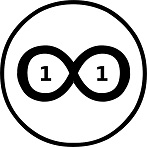

# keyuno v0.1.0

Introducing keyuno, a desktop application built with Electron JS. It provides a user-friendly interface for participating in the Event Economy.

## Disclaimer

Please note that this software is currently only for testing and development use, and provided "as is" without warranty of any kind. Use at your own risk.

## GitHub

The source code for keyuno 0.1.0 is available on GitHub:

https://github.com/keyuno/keyuno

##  Video Overview

<iframe  class="center-video" src="https://player.vimeo.com/video/838564452" width="640" height="360" style="border: none; allow="autoplay; allowfullscreen ></iframe>

# Event Economy

Event Economy is an economic system that provides incentives for creativity by treating any conceivable event as a valuable commodity. These events encompass a wide range, such as artistic creations, scientific breakthroughs, cultural artifacts, natural phenomena, innovative ideas, and significant historical moments. 

This framework facilitates the generation of digital objects known as 1/1 Bitcoin NFTs, which act as central reference points for events, enabling the authentication and monetization of information without the need to rely on third-party trust.

##  Digital Objects

The Bitcoin blockchain is frequently referred to as a decentralized ledger, and a reliable network for exchanging value without relying on a third-party trust. It can also be viewed as a digital space-time that enables the embedding of information as events, resulting in the creation of unique and verifiable digital objects that can be owned and traded.

At its core, Bitcoin is a secure and shared ledger that records transactions in a decentralized manner, with each block in the chain containing multiple transaction records that are permanent and cannot be altered or deleted once added to the chain. 

Counterparty protocol enabled the creation of digital assets. Each transaction of counterparty assets requires a btc fee, which adds greater utility to the bitcoin network and thus to the overall value of bitcoin itself. All digital assets created using counterparty gain the security of the bitcoin network.

When information is embedded into Bitcoin, it becomes a timestamped and permanently recorded event, which can be used to capture the essence of any type of information as 1/1 non-fungible tokens often referred to as NFTs. Bitcoin verifies the ownership and authenticity of digital assets and provides a means for representing and trading all types of content in a manner that is secure, transparent, and resistant to counterfeiting and fraud. 

Bitcoin NFTs are unique digital objects that exist in their ideal form, with any duplicates simply being imitations. The stability of the Bitcoin blockchain offers NFTs with long-term security, guaranteeing that they will remain protected for years to come. 

##  CryptoArt

CryptoArt is the act of capturing the interaction between digital scarcity and digital abundance. In essence, the combination of digital scarcity and dynamic representation creates a fascinating and engaging experience for both artists and viewers, and it opens up new possibilities for artistic expression and experimentation in the digital age.

At its core, CryptoArt is an art form that explores the dynamic interplay between digital scarcity and abundance. Digital scarcity refers to the limited quantity of certain types of digital objects. Once an object, a strict non-fungible 1/1 token is created, its supply cannot be increased or decreased, and the authenticity and ownership of the object are securely established on the blockchain. The static nature of digital scarcity is a key factor that gives CryptoArt its unique and valuable properties, and it creates new opportunities for artists and collectors alike in the digital realm. 

On the other hand, digital abundance refers to the fact that digital representation can be replicated and distributed infinitely. Moreover, it can be dynamic and responsive to changes in its environment.

 By recording every transaction on a decentralized ledger, a clear and verifiable history of ownership is established, which is commonly referred to as provenance. This means that anyone can trace the origin of a piece of CryptoArt back to its creator, and track every subsequent sale and transfer of ownership, ensuring authenticity and preventing fraud.

##  Store of Value

Digital ownership plays a crucial role in granting individuals the freedom and control to produce unique non-fungible tokens (NFTs) that serve as secure stores of value. Unlike physical assets, the ownership of digital assets is highly resistant to confiscation and not bound by physical location, making it a flexible and resilient form of value preservation.

Compared to traditional stores of value like gold or Bitcoin, storing value in 1/1 NFTs presents several advantages. While gold has historically been regarded as a reliable store of value, digital NFTs offer greater portability, and security. Moreover, Bitcoin may not be an optimal long-term store of value due to risks associated with fractional reserve practices.

Moreover, the collective good perspective of storing value in digital assets is noteworthy. By using digital assets as a means of preserving value, it becomes possible to free up valuable resources such as housing, enabling them to be utilized for their intended purposes instead of being tied up as stores of value. This approach addresses market distortions where physical assets, primarily serving as stores of value, disconnect from their true market value and intended use. This liberation of resources has the potential to mitigate affordability issues, improve availability, and foster a more efficient allocation of resources, ultimately benefiting society as a whole.

In contrast, physical collectibles are more susceptible to counterfeiting and require third-party trust for verification, making them less secure. By employing 1/1 NFTs as stores of value, individuals gain autonomy, security, and sustainable ownership over cultural assets they believe in. The higher the value of the collectible, the stronger the incentive to preserve it to maintain its worth.

# Universal Map of Knowledge

Universal Map of Knowledge is a system designed to provide access to reliable information to anyone with an internet connection. It is based on the idea of recording and commodifying events, and mapping them out via value communication. In essence, it is a decentralized system that enables individuals to capture events and link them to other events to create a greater context for knowledge.

Universal Map of Knowledge consists of two parts: a method to record and commodify events, and a method to map out events via value communication. The first part involves creating a new asset on a secure public ledger, which is Bitcoin. The asset represents an event, which can be anything from an artistic expression to a scientific discovery, a cultural artifact or a historic moment. The event is decided by the individual willing to pay the necessary fee to create an anchoring point of the event on the Bitcoin ledger.

The second part of the system involves value communication, which is used to link events together. To establish a connection between two assets, an arbitrary amount of UMOK token is sent from the address associated with the event asset to the address that is linked to the asset being connected to. If the connection is accepted, an arbitrary amount of UMOK token will be sent back, and a two-way link will be established between the two assets. 

In a simplified version of the Universal Map of Knowledge, events are associated with addresses based on timestamps instead of broadcast. This means that the earliest 1/1 NFT in the address history is considered to belong to the address. This frees up the option of broadcasting to be used to represent the event by broadcasting the IPFS content identifier of the representation.

The actual amount of UMOK tokens held in an event asset address is not what determines the connection to other assets. Instead, it is important to maintain a balance of UMOK tokens in the address, even if the amount is arbitrary. This is because the presence of the token in the address indicates that it is an active asset that might be connected to other assets.

To move an asset and its connections to a different address, the owner needs to transfer the asset to the new address along with an arbitrary amount of UMOK tokens from the old address to the new one. This will ensure that the connections associated with the asset are maintained and transferred to the new address as well.

To disconnect an asset from its connections, the owner simply needs to transfer the complete balance of UMOK tokens from the connected address to a different address. This will effectively break all connections associated with that asset. Alternatively, one can simply move the NFT itself to a different address. 

Connecting and disconnecting assets in the system requires careful consideration and planning. It incentivizes users to think carefully before making any changes to their asset connections, as disconnecting from one asset while maintaining connections to others can take effort. 

If you want to disconnect from a particular asset while maintaining connections to others, you will have to disconnect from all assets and then re-establish connections one by one. This encourages users to carefully choose which assets they want to connect, and to consider the potential long-term implications of their choices. Ultimately, this contributes to the quality of context within the system, as it encourages users to create more meaningful and well thought-out connections between assets.

##  Access to Truth

Access to truth is a human desire that drives us to seek out knowledge and understanding of the world around us. This desire is reflected in many aspects of our lives.

The art market provides a compelling example of how people value truth. When it comes to works of art, authenticity is highly prized. An identical copy of a famous artwork that is proven to be fake will not be valued as highly as the authentic original, even though the content may be identical. 

There is a strong market incentive to uphold the truth when it comes to NFTs. The market value of NFTs is intricately linked with their representation, including their connections and larger context. Therefore, there is a significant market incentive to uphold the truth about NFTs. Any misinformation or inaccuracy regarding NFTs can have a substantial impact on their market evaluation. 

Access to truth is crucial for making informed decisions, as it allows us to be more rational and deliberate in our choices. When we have access to accurate and reliable information, we can make better consumption decisions and ultimately improve our quality of life. The ability to distinguish between truth and falsehood empowers us to navigate complex situations with confidence and make decisions that are aligned with our goals and values.

## Better Web Experience

The current method of linking information through hyperlinks creates a distortion of context, making it difficult to see how information fits into a larger picture. This limits the exploration of context to a back button, ultimately devaluing the notion of having access to information.

Previously, there was no economic incentive to address this issue, leading to a dramatic increase of unreliable information on the web, commonly known as 'fake news'.

Universal Map of Knowledge, however, creates an environment that incentivizes participants to value truth. Event owners are responsible for maintaining the integrity of the general context in which their owned events exist. If this integrity is not properly maintained, the market value of their assets will decrease. 

One of the reasons why privacy is often compromised on the web is the reliance on ad-based business models, which incentivizes tracking of user behavior and personal information for targeted advertising. This creates a conflict of interest between the user's privacy and the business's need for data to generate revenue.

With Universal Map of Knowledge, the economic model is based on digital ownership, where users own their assets and have control over their data. This minimizes the need for third-party involvement and increases the freedom of the individual to not be beholden to centralized entities. This economic model, combined with the use of collectibles, incentivizes users to maintain the quality of their connections for better context and to minimize low-effort/spam content, which further contributes to a safer and more reliable environment for knowledge sharing.

Furthermore, the system incentivizes the creation and maintenance of quality connections, which helps to minimize low effort and spam content. Since users have to pay and connect with other assets, they are more likely to prioritize quality over quantity, as maintaining connections with low-quality assets could diminish the value of their own assets by association.

Overall, Universal Map of Knowledge provides a new paradigm for the organization and exchange of information on the web, one that prioritizes context, truth, and privacy while incentivizing quality and value creation. By creating an economic system that rewards these principles, Universal Map of Knowledge has the potential to transform the web into a more reliable and trustworthy source of knowledge.

## Digital Identity

In the Universal Map of Knowledge, your digital identity is closely tied to your NFT collections, as well as your contributions and the value you bring to the system. This is in contrast to the superficial identities that are often created on other platforms, where there is no real economic value attached to them.

In this system, users have the ability to prove their merit without having to disclose their real-world identities, or any other personal information if they choose not to. This provides a layer of privacy protection.

By tying digital identity to economic value and ownership, the Universal Map of Knowledge incentivizes users to create quality content and contribute to the system in meaningful ways. This also helps to minimize the trust that users must place in centralized entities, as they can own and control their own digital identity without relying on third parties.

Overall, the Universal Map of Knowledge seeks to create a more transparent, decentralized, and user-driven online environment, where individuals have control over their data and can be rewarded for their contributions to the system.

## The Reality of Objects of the Mind

In the Universal Map of Knowledge, we recognize that objects of the mind, such as ideas, thoughts, and emotions, are just as real and impactful as physical objects in the world. By acknowledging and valuing these objects of the mind, we can create a more holistic understanding of reality.

We acknowledge the importance of exploring the human mind in all its states and gathering data from our subjective experiences. Just as telescopes and microscopes have allowed us to explore the physical world in greater detail, new technologies and techniques can help us explore the inner workings of our minds.

Each individual will have a unique contribution to make. Like a puzzle piece, everyone will own a unit of truth that fits together with others to form a larger, more complete picture. By sharing our knowledge and perspectives, we can all work together to build a more comprehensive understanding of ourselves and the world around us. Even those who may not feel like they have anything to contribute right now, will have something valuable to share.

Every individual has a unique perspective and a valuable contribution to make to the Universal Map of Knowledge. This is something that cannot be automated away, as there is no substitute for human unique experience and interpretation. By sharing their perspectives and insights, individuals can help to create a more complete and accurate understanding of reality.

# NFT-Based Prediction Markets

Prediction markets allow people to bet on the outcomes of future events, but currently, they are more like gambling than investing, with no underlying asset to extract value from after the bet has been settled. The main problem with prediction markets is the need for a trusted third party to settle the bets, which creates a point of failure in the system.

A solution to these problems is to turn future events into digital objects. By utilizing the bitcoin blockchain, it is now possible to commodify and interlink any event imaginable, including future events. The platform that can be used to commodify events, including future events, is Counterparty protocol, which resides on top of bitcoin, ensuring that all digital assets created via Counterparty gain the security of the bitcoin network.

Unlike traditional prediction markets, NFT-based prediction markets are not a zero-sum game. Events that did not occur in 'consensus reality' could still have value as being part of an alternative timeline. Fictional or simulated timelines and the events that happen in them can be registered as independent events and be part of a larger construct.

NFT-based prediction markets offer an authentication advantage by eliminating the reliance on potentially unreliable third parties. Digital objects in these markets can be easily authenticated, providing a reliable means of verification. This is particularly advantageous for representing culturally significant events without physical anchors, as ownership and history can be securely recorded, ensuring authenticity. Through decentralization, NFT-based prediction markets remove the need for trust in centralized authorities, enabling participants to independently verify the authenticity of digital objects associated with specific events.

## The Oracle Problem

The Oracle Problem, specifically in the context of prediction markets, refers to the challenge of obtaining accurate and reliable information about real-world events in order to settle bets or contracts. In traditional prediction markets, this is typically done through a trusted third party who can provide the outcome of the event. However, this approach is vulnerable to manipulation and bias.

In NFT-based prediction markets, future events are treated as digital objects. Price discovery mechanism is used to determine the market value of assets that anchor versions of future events. The greater the market value of an asset, the higher the probability that the event it anchors will occur in the future. As a result, there is no need for an external source of information to determine the outcome of an event, effectively solving the oracle problem.

Owners who do not protect the integrity of the information associated with their assets, including the validity of connections, risk the decline of the monetary value of their assets. This creates a strong incentive for asset owners to provide reliable and accurate information, effectively putting an end to the era of fake news and post-truth.

## Probabilistic Communication

In this decentralized system, event outcomes are calculated using the formula P = E/Ψ, where P represents the probability of the event occurring (with a maximum value of 1 representing 100% confidence), E represents the specific event being predicted, and Ψ represents the sum of all events.

The market in NFT-based prediction markets handles the calculation of event outcomes through collective computation, with the event's probability reflected in its market price. Users have the ability to choose the valid events included in the calculation.

For instance, if we consider four events, labeled a, b, c, and d, with prices of 0.1 btc, 0.2 btc, 0.3 btc, and 0.7 btc respectively, the probability of event d occurring would be:

P(d) = E(d) / Ψ

where E(d) represents the value of event d, and Ψ represents the sum of all events.

In this example, the sum of all events would be:

Ψ = E(a) + E(b) + E(c) + E(d) = 0.1 btc + 0.2 btc + 0.3 btc + 0.7 btc = 1.3 btc

Therefore, the probability of event d occurring would be:

P(d) = E(d) / Ψ = 0.7 btc / 1.3 btc = 0.538 or 53.8% confidence level.

The decentralized approach to using market prices for predicting future events enables a trustless and accurate calculation of the probability of those events. This is achieved by leveraging collective intelligence and market prices to arrive at a consensus. 

An even greater insight could be gained by observing the connections between future events. This is because future events can be interconnected through a branching structure that follows an "if/then" type of logic. By analyzing these connections, we can gain a more comprehensive understanding of how future events are likely to unfold and how they may impact one another. 

It is important to note that the price of an event asset is dynamic and changes over time based on market demand and the probability of the event occurring. As new information becomes available or as market sentiment changes, the price of the asset will adjust accordingly. Hence, the probability of the event outcome reflected in the price is not fixed but rather constantly evolving and updating in real-time.

The P = E/Ψ formula can be used to convey information about future events as a form of communication. By assigning values to different events and calculating their probabilities using this formula, individuals or organizations can communicate their expectations and beliefs about the likelihood of certain outcomes.

Imagine having a communication channel with a distant location, such as Mars. The communication delay between Earth and Mars can be significant, making it challenging to transmit information about current events. However, what if we could predict future events accurately, based on market forces? This knowledge could be used to establish real-time communication with Mars, even if the events have not yet occurred.

The market-based oracle system provides a decentralized and trustless way to calculate the probability of future events. The formula P = E/Ψ, where P represents the probability of the event occurring, E represents the specific event being predicted, and Ψ represents the sum of all events, can be used to communicate the likelihood of future events.

Although the probability of future events as predicted by the system can be seen as incomplete knowledge, it is still useful when it arrives at Mars. As we get closer to the actual event, we gain more knowledge and the probability becomes more accurate. Therefore, we could use the market-based oracle system to establish a simulated future that "shortcuts" the speed of causality, allowing us to communicate with Mars based on the best predictions backed by market forces.

## Simulation as Observation

In the future, we are likely to see a significant increase in the use of simulations to extract valuable information. As we gain greater access to computational power and more sophisticated simulation techniques, we will be able to simulate different realities and timelines, allowing us to explore and understand them in ways that were previously impossible.

The market price mechanism plays a crucial role in managing resources for conducting these simulations. It determines how resources are allocated and which simulations are prioritized. Significant resources are required to extract useful information from simulations regarding future events. Allocating these resources efficiently through the market price mechanism ensures that valuable simulations are given priority.

As we continue to explore the possibilities of simulation, it's natural to wonder if there are limits to what we can simulate. Just as the speed of light limits the transfer of information, could there be a computational constant that restricts what future events can be simulated?

# AGI Model

There is economic value in knowledge. To unlock the hidden value of knowledge a method called masterkey was introduced in June 2017 to enable anyone to turn any type of information into digital objects (1/1 NFTs). The next step was the introduction of universal map of knowledge. It allowed the connection between digital objects to generate context and provide access to truth to anyone with an Internet connection.

In universal map of knowledge, context is governed by economic incentives and the price mechanism itself is there to determine what is true and what is false. In universal map of knowledge we also see how attention and meaning are distributed. The basic assumption is that the fluctuation in the market price of digital objects is correlated to the attention and meaning we give to specific information (events).  

Intelligent agents will be able to have direct access to universal map of knowledge and see exactly how attention and meaning are distributed, how connections and the fluctuating price of information change in real-time. They will see how information is organized. Intelligent agents will have an objective numeric value (fluctuation in the market price of digital objects) which will measure the economic value of the information.

To generate economic value, intelligent agents will be able to learn to combine existing ideas into novel ideas by constantly testing through trial and error which combination of information performs well on the market and which doesn’t. They will be able to analyze what kind of new information draws the most attention and generates the greatest economic value.

The central driving force of intelligent agents will be based on economic reward and punishment. The reward is the increase in the market value of digital objects held and managed by intelligent agents and the punishment is the loss of market value of those assets. The market itself will provide the input necessary to determine which new combination of information should survive and which should not. The economic constraints will mean that the process of generating new information will be as efficient as possible.  

This constant market feedback will allow intelligent agents to improve the process of new event generation until the process produces something of economic value. Because digital objects can represent anything, the generation of new meaningful information through machine learning can essentially be defined as the birth of AGI.

# Economic Simulation Hypothesis

The economic simulation hypothesis proposes that our reality is a computer-generated simulation created by advanced beings, and as such, the process of simulating such a complex reality would be a resource-intensive task for the simulators.

This hypothesis assumes that our reality is not of supernatural origin and that the creators of the simulation are not omnipotent, therefore, the simulators must utilize their resources efficiently. The price system is a well-known efficient method of allocating resources.

It is more probable that our reality exists in a simulation that generates economic value to one that doesn't. Simulations that fail to generate economic value are at risk of being terminated. 

## Economic Model

In a computational simulation, information is a key component of the simulated reality. For the simulation to be economically valuable, the information contained within it must hold potential economic value. A way to approach this is to treat emergent events within the simulation as assets. Emergent events can be defined as any type of information that can be represented as an asset and traded on the simulators' market. This approach allows the simulators to identify and extract economic value from the events within the simulation.

The treatment of emergent events as assets within the simulation would lead to two primary economic activities:

1. Event mining.

2. Event asset trading.

Event mining involves the systematic search for novel events within the simulation that have the potential to be transformed into valuable assets. This activity would only be sustainable in simulations capable of generating diverse events. Simulations with low event diversity would be shut down for failing to generate enough economic value.

Event asset trading, involves treating events, including future events, as assets and trading them on the simulators’ market. The probabilistic process and complexity of event formation guarantees the difficulty of predicting future events and thus makes prediction markets possible.

## Chain of Events

The simulation hypothesis relies on the assumption that the information extracted from the simulation must hold economic value for the simulators, who use event mining as part of their economic model. To maintain the integrity of the simulation and its event market, the simulators have an incentive not to interfere with the process of event formation. Bringing information from a competing timeline into our reality would break the chain of events and undermine the market.

Additionally, no information from the future can influence the past, and the outcome of events is final. This explains why the arrow of time only goes forward. If it were possible to prove that the chain of events could be broken, it would also prove that the economic simulation hypothesis is incorrect.

## Non-Fungibility Principle

The Non-Fungibility Principle principle states that no event can be completely identical to another event. This is because events are treated as unique and non-fungible assets that can be traded on the simulator's market. If events were completely identical to each other, they would lose their economic value as assets. Therefore, maintaining the non-fungibility of events is essential for the economic model of the simulation to work.

## Zero-Feedback Event Generation

Zero-feedback event generation within the simulation aims to maintain market relevance without direct feedback from the simulators. In this context, consciousness plays a crucial role. It acts as a bridge between the simulators and the simulation, providing coherence to the simulated events without establishing a direct connection. Its function is to differentiate between noise and signal, determining which events are relevant and hold potential economic value.

Consciousness serves as a zero-feedback filter, eliminating irrelevant information and transforming data into meaningful information that aligns with the simulators' interests. It accomplishes this without explicit instructions from the simulators, preserving the integrity of the simulation by preventing outside intervention, contamination, and potential corruption.

## Self-Definition of Information

To establish a fair market within the simulation, the hypothesis suggests that the simulation itself defines the information from within. This bottom-up self-definition process involves granting consciousness to all systems, whether biological or non-biological, creating a diverse range of perspectives.

By interacting with one another, these systems generate event diversity, leading to feedback loops, and discrete moments of self-definition. Such self-definition is deemed the driving force behind all valuable occurrences within the simulation.  

Self-defined information has a notable advantage in preventing secret simulations. Through reliance on self-defined objective reality, simulations gain transparency and resistance against manipulation. This absence of secret simulations ensures market integrity, enabling the viability of prediction markets.

## Law of Efficiency

The Law of Efficiency governs the formation of new events within the simulation. It asserts that the process of formation of novel events must be efficient, with the least amount of energy, space, and time required to define as much as information as possible.

The level of complexity or consciousness within a system is directly proportional to its efficiency in defining new events.

The Law of Efficiency can be expressed as follows:

E = kC

where E represents the efficiency of the system in defining new events, C represents the level of complexity or consciousness within the system, and k is a constant of proportionality that represents the efficiency of the system when its level of complexity or consciousness is equal to 1 (i.e., at the lowest level).

The equation suggests that the efficiency of the system in defining new events (E) is directly proportional to its level of complexity or consciousness (C). As the system becomes more complex or conscious, its efficiency in defining new events will increase proportionally.

In the context of the Law of Efficiency, emergence is seen as a natural result of systems working towards higher efficiency. As a system becomes more efficient in defining information, it may exhibit emergent properties that are more complex and sophisticated than its individual components.

Furthermore, the Law of Efficiency suggests that the amount of consciousness within a system is a result of its efficient work. This means that as a system becomes more efficient at defining information, it may exhibit higher levels of consciousness. All systems, from simple to complex, exist on an efficiency scale, where their efficiency in defining information can be potentially measured and compared. 

## Hard Problem of Consciousness

The economic simulation hypothesis posits that subjective experience in our reality is economically essential. Consciousness, as a fundamental property, is integral to generating economically valuable events within the simulation. By attributing consciousness to all systems, the simulation meets the market's requirements for trustless, transparent, efficient, hard-to-predict, and diverse formation and validation of novel events with economic potential.

The economic necessity of self-defined simulated reality presents a potential resolution to the hard problem of consciousness.

## Metaphor 

Metaphors can be viewed as systems that are governed by the Law of Efficiency, just like any other system. For example, when Bob shares the metaphor "Juliet is the sun" with Alice, the meaning of this metaphor for Bob may be interpreted differently by Alice based on the semantic associations she makes. The Law of Efficiency governs how the metaphor is processed and understood by Alice, with the most probable interpretation being the most efficient one. This efficient processing of the metaphor involves using the least amount of energy and space, being done as quickly as possible, and making as many associations in the semantic field as possible.

The information we are exposed to is efficiently defined by the symbolic field within our minds. The main metaphors that occupy space in our minds are in control of what we think and do, and ultimately shape our worldview and our identity.

The semantic field is part of a larger symbolic field that includes non-linguistic symbols that engage our senses. The organization of symbols within the symbolic field is efficient, and this can help explain dream logic. 

Dream logic arises from the efficient organization of information within the symbolic field of our minds. This field encompasses both linguistic and non-linguistic symbols, and it shapes the content of our dreams in a manner that can appear nonsensical. While dreaming the experience represents an optimal synthesis of information, achieved through the efficient combination of diverse symbols within the symbolic field.

# Improvements

1. Enhanced decentralization: minimizing dependence on external parties.

2. AI: incorporating artificial intelligence to enhance the platform's user experience, automation, and decision-making capabilities.

3. Collection: enabling users to collect, manage, and share their digital object collections with others.

4. Communication: implementing decentralized micro-blogging and direct messaging features to facilitate real-time communication between users.

5. Better DEX: improving the decentralized exchange (DEX) to allow for seamless ownership and trading of digital assets.

6. Collateral-based lending: develop a system for collateralized lending that enables borrowing and lending of digital assets.

7. Crowd-streaming (TipJar): introduce a feature allowing users to tip creators using lightning network by dividing content such as music, books, or movies into small, paywalled segments. Upon collectively unlocking all segments, an NFT representing the complete content is rewarded to a randomly selected participant.

8. Prediction market interface: incorporating a prediction market interface to enable users to gain insight into future events.

9. Coordination and planning: empowering users to connect with each other, pool their resources, and coordinate their efforts to successfully plan and execute projects (new events).

10. Virtual reality integration: integrating VR technology to enhance the user experience.

11. Simulation - event mining: implementing a computer simulation that enables users to mine events.

# Resources 

Expanding the concept of 1/1 Bitcoin NFTs to encompass a vast range of information (June 13, 2017):

https://reddit.com/r/counterparty_xcp/comments/6gyp2b/masterkey_event_economy/

First asset within the framework:

Description: Eureka, Edgar Allan Poe (1848)

NFT ID: A10972963311043207000

2017-06-13

Quantity: 1/1  

https://xchain.io/tx/957506

Constructing Universal Map Of Knowledge (August 29, 2017):

https://medium.com/p/7fcd03a084d9

Prediction Markets as Digital Commodity Markets (September 11, 2017):

https://medium.com/p/be754bf71410

Demo transaction documentation:

https://reddit.com/r/counterparty_xcp/comments/6ze8bf/prediction_markets_as_digital_commodity_markets/dmy0f9s/

Simulation Hypothesis, Efficiency And The Hard Problem (February 2, 2018):

https://medium.com/p/d6064de641e6

First Bitcoin 1/1 NFT collection (March 24, 2018):

https://keyuno.github.io/masterkey/index.html

The birth of AGI: How machines will learn to express meaning (April 23, 2018):

https://medium.com/p/d5068edcce1c

CryptoArt definition (December 7, 2018):

https://twitter.com/officialkeyuno/status/1070957502085431296

# Privacy Policy

We are committed to protecting your privacy. We do not collect any personal information from our key.studio website visitors and keyuno  software users. We do not use any trackers, cookies, or similar technologies.

Please be aware that external links on our website and our software may collect information about you. We have no control over these sites and are not responsible for their privacy practices. We encourage you to review the privacy policies of any sites you visit.

In addition, please note that our website and software is hosted by GitHub. We have no control over their data collection practices and are not responsible for their privacy policies. We encourage you to review GitHub privacy policy to learn more about their data collection practices.

We do not use any analytics tools on our website or in our software, and we have no plans to do so in the future. We respect your right to privacy.

# Terms and Conditions

By using this keyuno software and accessing the key.studio associated website, you agree to the following terms and conditions. Please read them carefully.

License

1.1. The software is provided under the terms of the MIT License. You are granted a non-exclusive, worldwide, royalty-free license to use, copy, modify, merge, publish, distribute, sublicense, and/or sell copies of the software.

Use of the Software and Website

2.1. You acknowledge that the software is an experimental program and is provided "as is," without warranty of any kind, express or implied, including but not limited to the warranties of merchantability, fitness for a particular purpose, and non-infringement.

2.2. You understand and agree that you are solely responsible for the content that the software serves or displays, and you shall not hold the software owner liable for any claims, damages, or liabilities arising from the content served or displayed by the software.

2.3. You shall comply with all applicable laws and regulations while accessing the website and using the software and refrain from engaging in any unauthorized or harmful activities.

Limitation of Liability

3.1. In no event shall the software author or the website owner be liable for any direct, indirect, incidental, special, or consequential damages, including but not limited to loss of profits, data, or business opportunities, arising out of the use or inability to use the software or the website.

3.2. You agree to indemnify and hold harmless the software author and the website owner from any claims, damages, or liabilities arising from your use of the software or the website or the content served or displayed.

<footer>
  

  
♾ 2023 key.studio

</footer>
